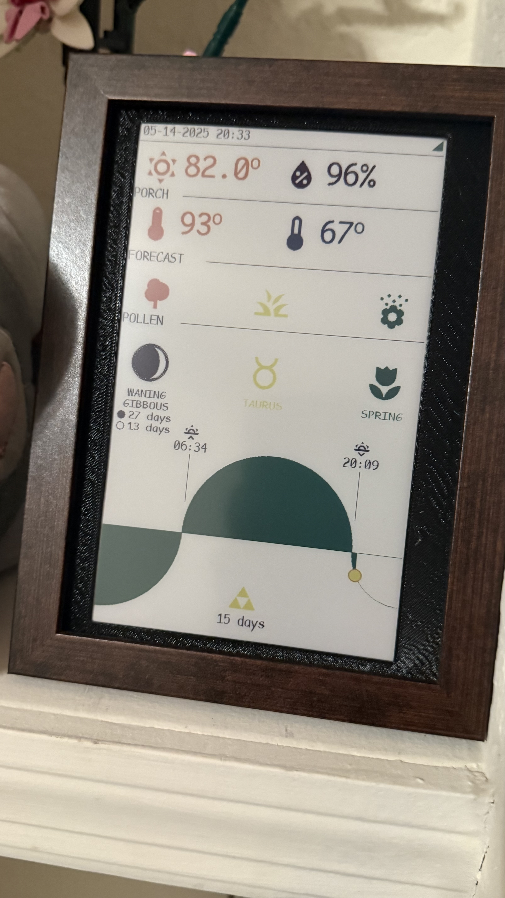

# epaper-frame
Waveshare 7.3" 7-color frame powered by Home Assistant &amp; ESPHome

# components

* Waveshare 7.3" 7-color ePaper
* ESP32
* Home Assistant for the data
* ESPHome for the interface to the ePaper display and the C code to draw circles
* The inner frame from https://github.com/rob-g2-365/waveshare_epaper_picture_frame to fit it in a picture frame
* An inexpensive 5x7 picture frame

# data sources
* ESPHome + BME280 (porch)
* National Weather Service (high / low / current conditions icon)
* Kleenex Pollen Radar (pollen levels) - custom component
* Moon (current moon phase)
* Lunar Phase (counts to moon phases) - custom component
* Zodiac (current sign)
* Season (current astrological season)
* Sun (sunrise / sunset / current position)
